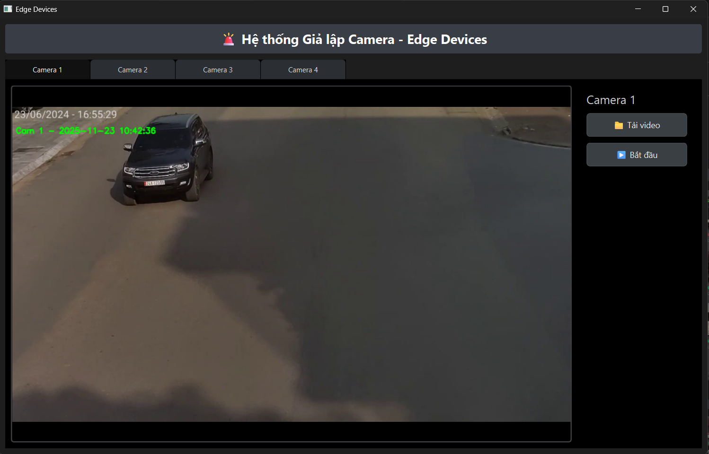
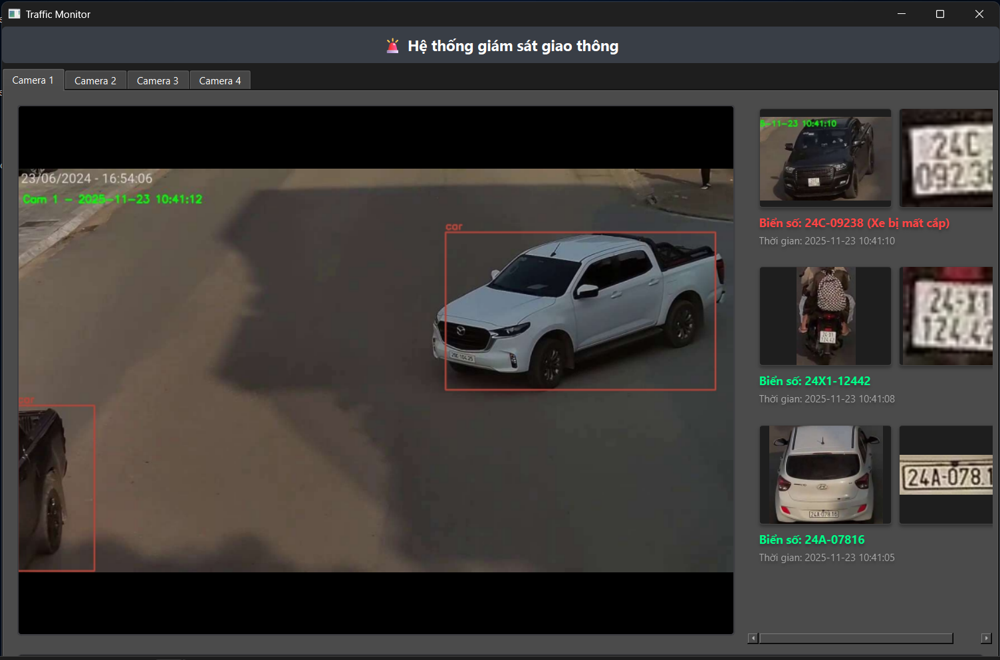
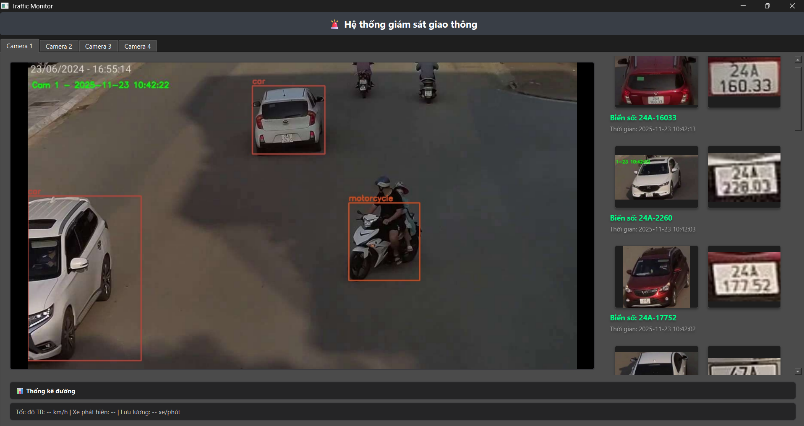
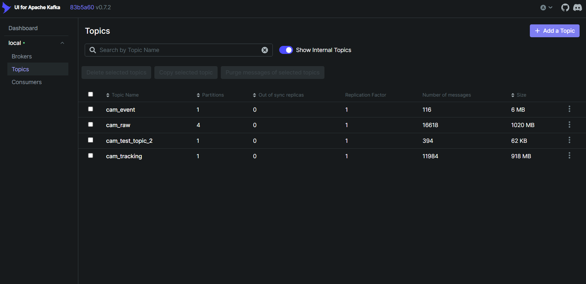
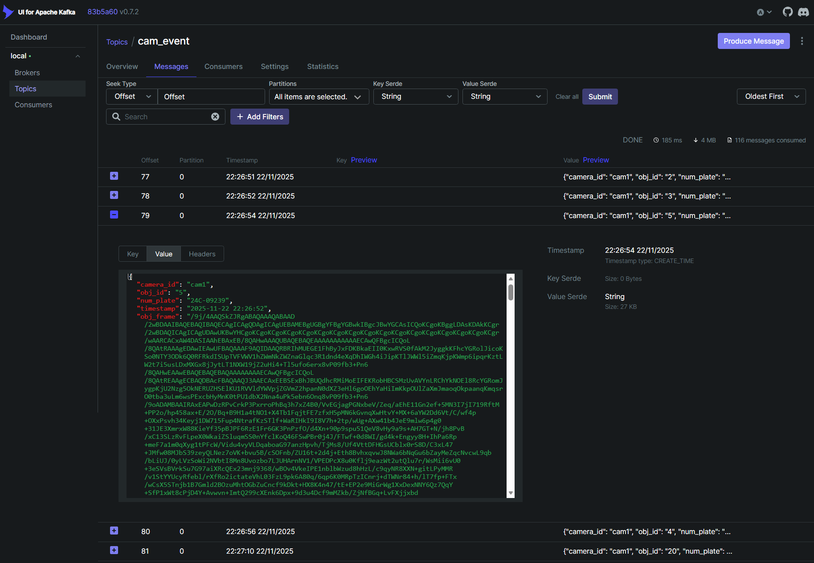
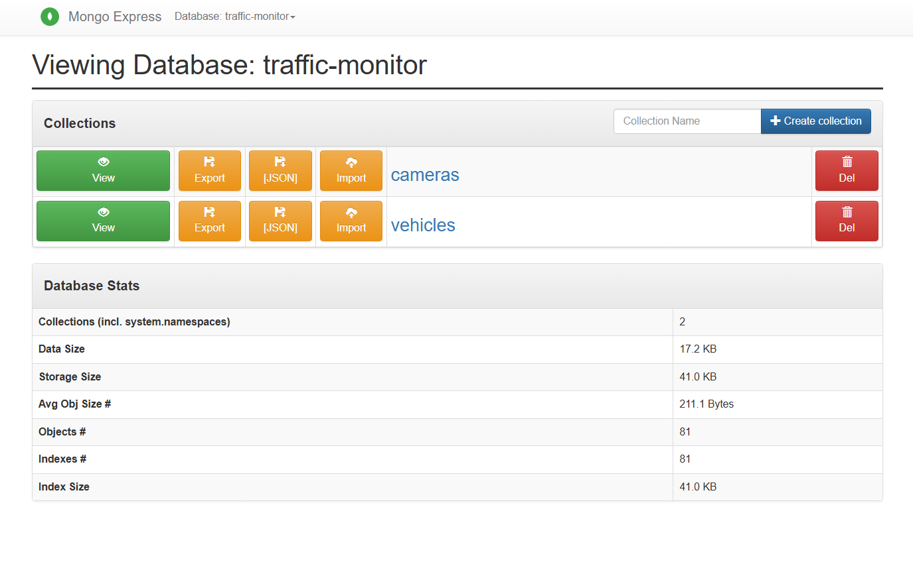

# Giám sát giao thông thời gian thực

 
  

Dự án này xây dựng một hệ thống cơ bản cho việc giám sát giao thông theo thời gian thực, với dữ liệu được thu thập từ các camera an ninh, sử dụng công nghệ xử lý dữ liệu lớn làm nền tảng và học sâu cho các mô hình phân tích.

    <a href="resources/report.pdf">Xem báo cáo</a>
    -
    <a href="report/report.pdf">Xem bản trình bày</a>
    -
    <a href="report/report.pdf">Xem demo</a>
    

## Về dự án

Dự án này xây dựng một hệ thống giám sát giao thông tự động, dựa trên nhiều camera khác nhau, có khả năng theo dõi các phương tiện, nhận diện biển số, phát hiện các vi phạm (nếu có), phân tích tình trạng giao thông với dữ liệu được gửi liên tục từ hệ thống camera đó trong thời gian thực. Trong đó:
* Trong việc xử lý luồng dữ liệu theo thời gian thực, hệ thống được tích hợp Apache Kafka và Apache Flink. Apache Kafka dùng cho việc thu thập và truyền phát dữ liệu liên tục theo thời gian thực. Apache Flink để xử lý dữ liệu luồng theo thời gian thực với hiệu suất cao và khả năng mở rộng dễ dàng khi lượng dữ liệu tăng cao.
* Trong bài toán theo dõi và phát hiện, hệ thống triển khai mô hình YOLO, CNN cùng thuật toán khác cho các bài toán giám sát giao thông như nhận diện biển số xe, phát hiện các lỗi vi phạm và phân tích tình trạng giao thông.
* Các dữ liệu trong quá trình xử lý sẽ được lưu vào MongoDB để giúp quản lý và truy xuất thông tin giao thông về sau được dễ dàng. Tuy nhiên, phạm vi của dự án này là xử lý dữ liệu lớn, cho nên hệ thống mới dừng lại ở mức thao tác với cơ sở dữ liệu, chưa khai thác triệt để phần lưu trữ dữ liệu này.

Dự án này là một phần trong bài tập lớn cuối kỳ, môn *Công nghệ dữ liệu lớn cho Trí tuệ nhân tạo*, năm học 2025-2026, Viện Trí tuệ nhân tạo, Trường Đại học Công nghệ, Đại học Quốc gia Hà Nội.

## Cài đặt

## Demo

### Trình mô phỏng camera an ninh

### Trình giám sát giao thông

### Theo dõi Kafka

### Cơ sở dữ liệu

